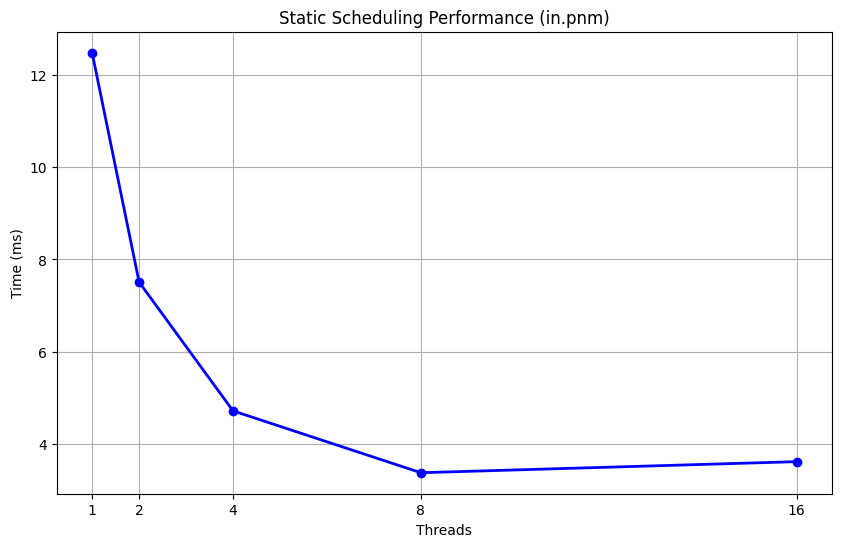
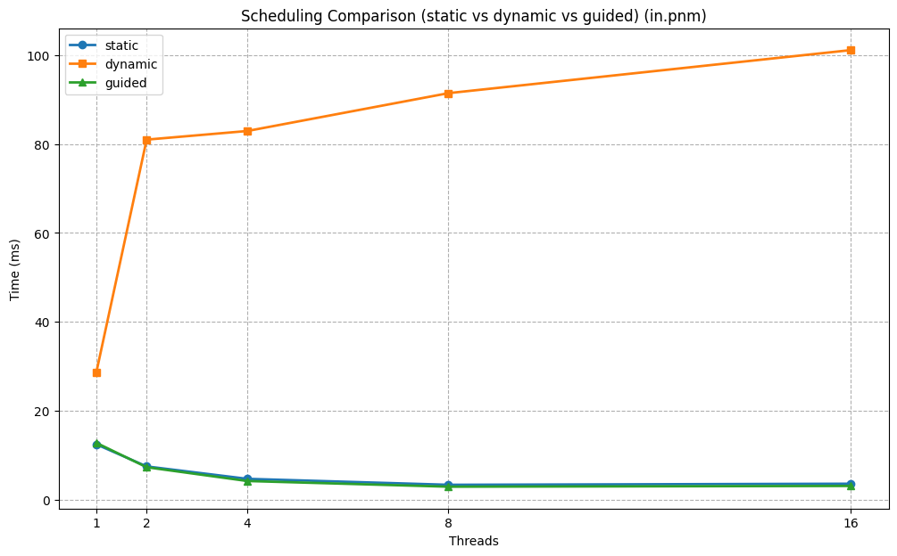
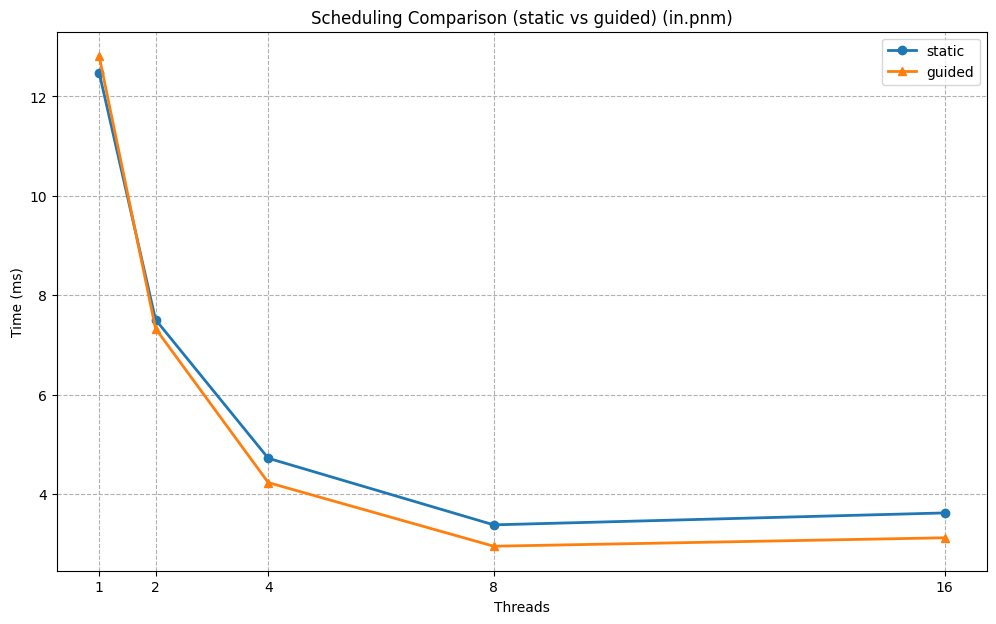
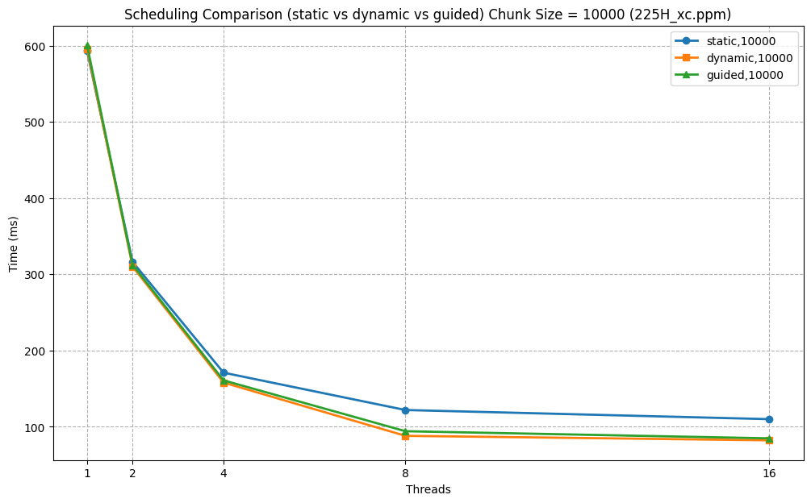
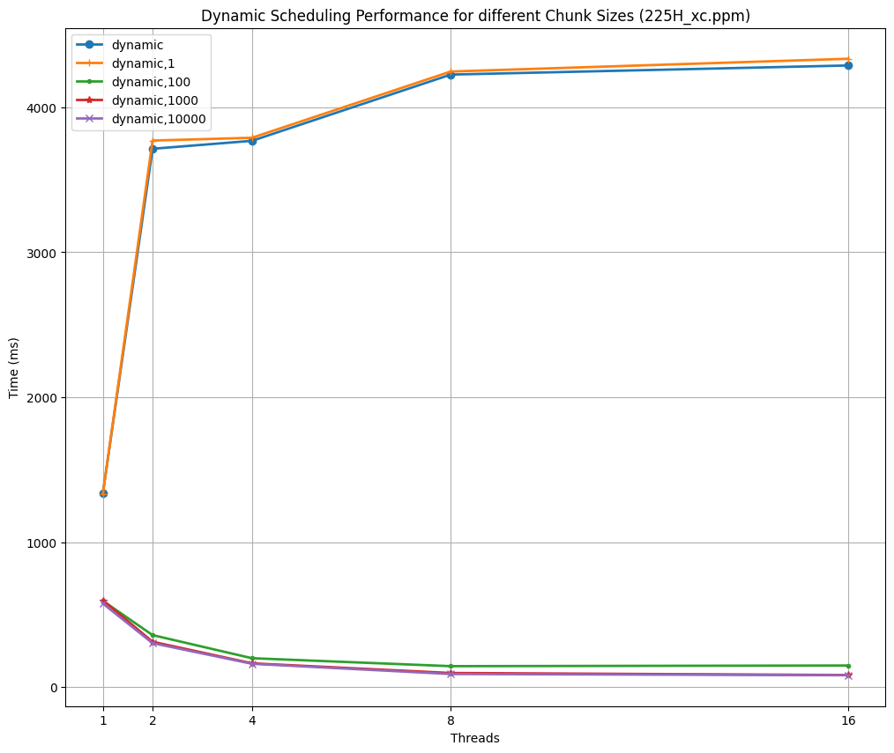

# OpenMP-threads-project
 Paralelization using OpenMP in C++ / Павлович Джурдже 

## 1. Введение

В данной лабораторной работе реализован алгоритм автоматической коррекции яркости и контрастности для цветных изображений в формате PPM (P6). Основная задача — улучшить контраст изображения путём растяжения гистограммы пикселей от некоторого минимума до максимума.

Для увеличения производительности используется многопоточность с помощью OpenMP. Код параллелизует основные этапы обработки изображения:

1. Подсчёт гистограммы
2. Применение функции переноса к каждому пикселю

## 2. Характеристики тестового стенда

- CPU: AMD Ryzen 7 5800H 8 ядер / 16 потоков
- RAM: 32 GB
- OS: Windows 11
- Компилятор: GNU g++ 14.2.0

## 3. Реализация

Строится общая гистограмма, где учитываются все три канала (R, G, B). Находятся границы minY и maxY для растяжения, при этом игнорируется небольшая доля крайних значений, заданная параметром `coef`.

Выполняется линейное масштабирование каждого пикселя:

`newVal = (oldVal - minY) / (maxY - minY) * 255`

### Параллельный подсчёт гистограммы

Используется директива `#pragma omp parallel` с локальными массивами-гистограммами в каждом потоке. Цикл по пикселям размечается с помощью `#pragma omp for schedule(static)`. Каждый поток инкрементирует локальную гистограмму, а затем в секции `#pragma omp critical` добавляет результаты в глобальную гистограмму.

### Параллельная обработка пикселей

Также используется директива `#pragma omp parallel for schedule(dynamic,)`.

Каждый поток обрабатывает свою часть пикселей, вычисляя новое значение по формуле `(oldVal - minY) / (maxY - minY) * 255`.

Так как операция деления считается относительно дорогой, можно один раз вычислить коэффициент:

`float division = 255.0f / (maxY - minY);`

и далее в цикле использовать:

`newVal = (oldVal - minY) * division;`
## 4. Тестирование
Тестирование проводилось на изображении **in.pnm**

Наблюдается линейное уменьшение времени выполнения с увеличением количества потоков. При использовании 8 и 16 потоков разница незначительна.

Наиболее эффективным оказался вариант с `schedule(dynamic, 10000)`.

Причины выбора именно этого варианта расписания:

Лучший баланс нагрузки между потоками, так как нет сильной зависимости от производительности отдельных потоков.

Оптимальный chunk size (10000) позволяет минимизировать дополнительные расходы (overhead) на частые переключения и запросы новых заданий, одновременно предотвращая ситуацию, когда один поток долго занят слишком большим фрагментом.

Критическая секция (#pragma omp critical) выполняется с меньшей вероятностью одновременного доступа, так как потоки завершают свои части работы асинхронно, что значительно снижает задержки. 

В случае использования статического расписания потоки чаще завершаются одновременно, что увеличивает время ожидания доступа к критической секции.

При dynamic (особенно с удачно подобранным chunk), приход в критическую секцию может равномернее распределяться во времени, и, соответственно, критическая секция не становится таким «бутылочным горлышком».
